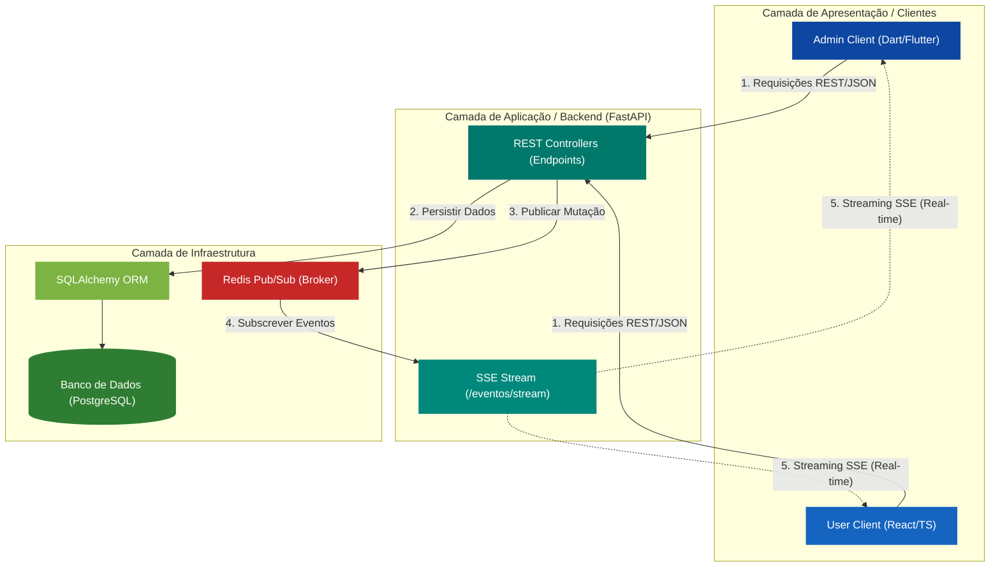

# Relatório Técnico: Aircraft Manager

**Desenvolvimento de Sistema Distribuído para Gerenciamento de Frotas Aéreas**

| Informação     | Detalhes                                                |
| :------------- | :------------------------------------------------------ |
| **Disciplina** | Sistemas Distribuídos (QXD0043)                         |
| **Professor**  | Rafael Braga                                            |
| **Dupla**      | Anaildo Nascimento (552836) & Rewelli Oliveira (554047) |
| **Data**       | 08/06/2026                                              |

### 🔗 Repositórios do Projeto

- **API (Python/FastAPI):** [github.com/RewelliOliveira/aircrafts-api](https://github.com/RewelliOliveira/aircrafts-api)
- **User UI (React/TS):** [github.com/RewelliOliveira/aircraft-user-interface](https://github.com/RewelliOliveira/aircraft-user-interface)
- **Admin UI (Flutter):** [github.com/Anaildo/aircrafts-admin](https://github.com/Anaildo/aircrafts-admin/tree/main)

---

## 1. Arquitetura Geral do Sistema

O sistema é construído sob uma **Arquitetura Desacoplada**, dividida em três componentes principais que se comunicam via rede utilizando protocolos modernos de intercâmbio de dados (**REST/JSON**) e mensageria (**Pub/Sub**).

### 1.1. Diagrama de Arquitetura

### 1.2. Estrutura e Organização dos Componentes

#### 🔹 Cliente Administrativo (Flutter)

Focado em operações de escrita e gestão de dados.
| Diretório | Descrição |
| :--- | :--- |
| `lib/models/` | Modelos de dados serializáveis em JSON. |
| `lib/services/` | Lógica de rede (REST e SSE). |
| `lib/screens/` | Camada de UI (Views e Formulários). |

#### 🔹 Servidor de Aplicação (Python/FastAPI)

O núcleo do sistema distribuído.
| Diretório | Descrição |
| :--- | :--- |
| `app/broker/` | Integração com Message Broker (Redis). |
| `app/crud/` | Lógica de persistência e regras de negócio. |
| `app/routers/` | Endpoints REST e streaming de eventos. |
| `app/schemas/` | Contratos de dados (Pydantic). |

#### 🔹 Cliente de Monitoramento (React/TS)

Focado em visualização reativa e alta performance.
| Diretório | Descrição |
| :--- | :--- |
| `src/components/` | Dashboards e visualizações reativas. |
| `src/hooks/` | Consumo assíncrono de eventos (SSE). |
| `src/services/` | Abstração de chamadas à API REST. |

---

## 2. Trabalho 3: Implementação da Web Services / API REST

O sistema utiliza o paradigma **RESTful** para comunicação síncrona, eliminando dependências de baixo nível (sockets) e garantindo **Interoperabilidade** entre linguagens (Python, Dart e TypeScript).

### 2.1. Objetos Distribuídos e Recursos

Os dados são expostos como recursos identificáveis via URIs:

1.  **CompanhiaAerea** (`/companhias`)
2.  **Aeronave** (`/companhias/{id}/aeronaves`)
3.  **EventoStream** (`/eventos/stream`)

### 2.2. Operações Remotas (Invocação via Verbos HTTP)

- **POST**: Criação de recursos (Passagem por Valor via JSON).
- **GET**: Recuperação de estado (Consulta de frotas).
- **DELETE**: Destruição de recursos (Passagem por Referência via ID).

---

## 3. Trabalho 4: Comunicação Indireta (Pub/Sub)

Para o Trabalho 4, implementamos o padrão **Publish-Subscribe** utilizando **Redis** para garantir o desacoplamento do sistema.

### 3.1. Justificativa Técnica

A escolha pelo Pub/Sub visa a escalabilidade e a experiência do usuário. O sistema permite atualizações em **tempo real** sem a necessidade de _polling_ constante, reduzindo drasticamente o consumo de banda e carga no servidor.

### 3.2. Desacoplamento Comprovado

- **Desacoplamento Espacial:** O produtor (Admin) não conhece os IPs dos consumidores (Usuários). A mensagem é disseminada pelo Broker de forma anônima.
- **Desacoplamento Temporal:** A API realiza a persistência no Banco de Dados independente do estado dos consumidores. Clientes que entram no sistema posteriormente recuperam o estado estável via GET e passam a ouvir o fluxo dinâmico via SSE.

---

## 4. Análise de Overhead e Desempenho

A introdução de camadas de indireção (Redis/SSE) adiciona uma pequena latência, mas os benefícios superam os custos:

| Overhead Identificado     | Estratégia de Mitigação                                                |
| :------------------------ | :--------------------------------------------------------------------- |
| **Latência Adicional**    | Melhora na percepção de velocidade do usuário via atualizações _Push_. |
| **Conexões Persistentes** | Gerenciamento via **I/O Não-Bloqueante** (FastAPI Async).              |
| **Complexidade de Infra** | Uso de **Docker Compose** para orquestração simplificada.              |

---

## 5. Conclusão

O **Aircraft Manager** demonstra como princípios de sistemas distribuídos podem ser aplicados para criar aplicações modernas e resilientes. Através do uso de APIs REST bem definidas e sistemas de mensageria, conseguimos um equilíbrio entre robustez e performance, atendendo integralmente aos requisitos acadêmicos propostos.
